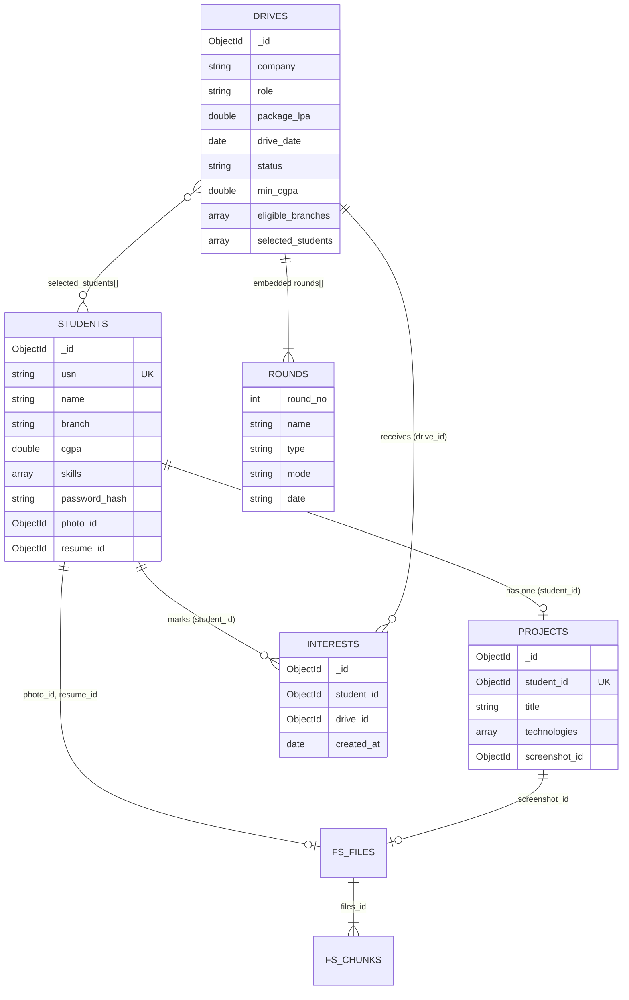

<div align="center">

# CampusHire

### Student Placement Management System

An ADBMS mini project that shows MongoDB's advanced features in a real, working web app.


</div>

---

## Table of contents
1. [About](#about)
2. [Features](#features)
3. [Tech stack](#tech-stack)
4. [Database design](#database-design)
5. [ADBMS concepts implemented](#adbms-concepts-implemented)
6. [Analytics dashboard](#analytics-dashboard)
7. [Getting started](#getting-started)
8. [Configuration](#configuration)
9. [Project structure](#project-structure)
10. [Screenshots](#screenshots)
11. [Useful mongosh queries](#useful-mongosh-queries)
12. [Security](#security)
13. [Troubleshooting](#troubleshooting)
14. [Future scope](#future-scope)
15. [License](#license)

---

## About
CampusHire lets students build a placement profile and follow company drives, while the placement officer manages drives, searches students, downloads resumes, publishes results and watches live analytics.

The project is built for the **Advanced Database Management Systems (ADBMS)** lab, so the focus is on the database layer: multiple collections, GridFS, ObjectId relationships, embedded documents, aggregation pipelines, regex search and indexing, not just CRUD.

## Features

### Student
- Register with **USN + password** (salted hash) and log in securely
- Upload a **profile photo** and a **PDF resume** (stored in GridFS)
- Add **one project** with a screenshot
- View and edit profile
- Browse placement drives and **search by company and role**
- **Mark interest** in a drive, with an automatic CGPA and branch eligibility check
- View **completed drives and the students selected**

### Placement officer (admin)
- Secure admin login and a single analytics dashboard
- View all student profiles; **search by name, USN, branch and skills**
- **Download or preview resumes** and view uploaded projects
- **Add, edit and delete** placement drives, including multiple rounds
- See **interested students per company** (with CSV export)
- **Publish selected students** for completed drives

## Tech stack
| Layer | Technology |
|---|---|
| Backend | Python, Flask |
| Database | MongoDB with PyMongo |
| File storage | GridFS (`fs.files`, `fs.chunks`) |
| Frontend | Jinja2, Bootstrap 5, Bootstrap Icons, Poppins, Chart.js |
| Theme | White and blue, glassmorphism cards, responsive |

## Database design



| Collection | Purpose |
|---|---|
| `students` | Student profile, credentials (hashed), references to GridFS files |
| `projects` | One project per student, with technologies and a screenshot reference |
| `drives` | Company drives with embedded `rounds[]` and `selected_students[]` |
| `interests` | Which student is interested in which drive |
| `admins` | Placement officer account |
| `fs.files`, `fs.chunks` | GridFS storage for photos, screenshots and PDF resumes |

## ADBMS concepts implemented

| Concept | Where / how |
|---|---|
| Multiple collections | `students`, `projects`, `drives`, `interests`, `admins` |
| GridFS | Photos, project screenshots, PDF resumes. Uploads are validated by file signature, not just extension (`save_upload`, `serve_file` in `app.py`) |
| ObjectId relationships | `projects.student_id`, `interests.student_id / drive_id`, `drives.selected_students[]`, `photo_id`, `resume_id`, `screenshot_id` |
| Embedded documents | `drives.rounds[]` (`round_no`, `name`, `type`, `mode`, `date`) |
| Aggregation pipelines | `$group`, `$lookup`, `$unwind`, `$addFields`, `$project`, `$sort`, `$limit`, `$addToSet`, `$size`, `$toLower`, `$ifNull` (`database.py`) |
| Regex search | `$regex` with `$options: "i"` on company, role, name, USN, skills (array) and technology. User input is escaped |
| Unique indexes | `students.usn`, `admins.username`, `projects.student_id` |
| Compound indexes | `interests(student_id, drive_id)` unique, `students(branch, cgpa)`, `drives(status, drive_date)`, `drives(company, role)` |
| Multikey indexes | `students.skills`, `projects.technologies`, `drives.selected_students` |
| Cascade clean-up | Deleting a drive also deletes its `interests` |

All collections and indexes are created automatically on first run.

## Analytics dashboard
Every figure comes from a MongoDB aggregation pipeline.

| Metric | Pipeline |
|---|---|
| Students by branch | `students` → `$group` |
| Interest by company | `interests` → `$lookup drives` → `$unwind` → `$group` |
| Projects by technology | `projects` → `$unwind technologies` → `$group` (case-insensitive) |
| Upcoming vs completed drives | `drives` → `$group` on `status` |
| Students placed | `drives` → `$unwind selected_students` → `$group` with `$addToSet` → `$size` |
| Collection counts | `count_documents` on every collection |
| GridFS file count | `fs.files`, `fs.chunks` and size by file type via `$group` |

## Getting started

### Prerequisites
- Python 3.9 or newer
- MongoDB running locally (`mongodb://localhost:27017`) or a MongoDB Atlas connection string

### Installation
```bash
# 1. Clone the repository
git clone https://github.com/<your-username>/campushire.git
cd campushire

# 2. (Optional) create a virtual environment
python -m venv venv
venv\Scripts\activate            # Windows
source venv/bin/activate         # macOS / Linux

# 3. Install dependencies
pip install -r requirements.txt

# 4. Make sure MongoDB is running, then start the app
python app.py
```
Open **http://127.0.0.1:5000**

> Do not run `pip install gridfs`. GridFS is included with PyMongo.

### First run
The app automatically creates the `campushire` database, collections and indexes, creates the officer account, and loads the sample data from `sample_data/` (12 students, 8 drives, projects, interests, plus sample photos, screenshots and PDF resumes in GridFS).

### Demo logins
| Role | Username / USN | Password |
|---|---|---|
| Placement officer | `admin` | `Admin@123` |
| Student | `CH22AI001` (any USN in `sample_data/students.json`) | `Student@123` |

Reset the sample data any time with `python seed.py --reset`.

### Landing page image
The home page shows `static/images/main.png` on the right. Replace it with your own picture (a transparent PNG looks best).

## Configuration
Set these as environment variables (all optional):

| Variable | Default | Purpose |
|---|---|---|
| `MONGO_URI` | `mongodb://localhost:27017` | MongoDB or Atlas connection string |
| `MONGO_DB` | `campushire` | Database name |
| `SECRET_KEY` | development value | Flask session key. **Set your own for any real deployment** |
| `ADMIN_USERNAME` / `ADMIN_PASSWORD` | `admin` / `Admin@123` | Officer account created on first run |
| `SEED_SAMPLE_DATA` | `1` | Set to `0` to start with an empty database |
| `PORT` | `5000` | Server port |
| `FLASK_DEBUG` | `1` | Set to `0` to turn off debug mode |

## Project structure
```
campushire/
├── app.py              # Flask routes, auth, uploads, validation
├── database.py         # MongoDB connection, GridFS, indexes, aggregation pipelines
├── seed.py             # Loads sample_data/ into MongoDB and GridFS
├── requirements.txt
├── sample_data/        # students.json, projects.json, drives.json, interests.json
├── templates/          # Jinja templates: auth/, student/, admin/
├── static/
│   ├── css/style.css
│   ├── js/main.js
│   └── images/main.png # Landing page image
└── docs/screenshots/   # Screenshots used in this README
```

## Screenshots
Add your screenshots to `docs/screenshots/` and they will show up here.

| Landing page | Student dashboard |
|---|---|
|  |  |

| Placement drives | Admin analytics |
|---|---|
|  |  |

## Useful mongosh queries
```js
use campushire
show collections
db.students.getIndexes()
db.interests.getIndexes()
db.fs.files.find({}, { filename: 1, length: 1, "metadata.type": 1 })
db.fs.chunks.countDocuments()

// Regex search on the skills array
db.students.find({ skills: { $regex: "py", $options: "i" } }, { name: 1, usn: 1, skills: 1 })

// Interested students per company
db.interests.aggregate([
  { $lookup: { from: "drives", localField: "drive_id", foreignField: "_id", as: "drive" } },
  { $unwind: "$drive" },
  { $group: { _id: "$drive.company", interested: { $sum: 1 } } },
  { $sort: { interested: -1 } }
])

// Selected students for completed drives
db.drives.aggregate([
  { $match: { status: "completed" } },
  { $lookup: { from: "students", localField: "selected_students", foreignField: "_id", as: "selected" } },
  { $project: { company: 1, "selected.name": 1, "selected.usn": 1 } }
])
```

## Security
- Passwords are stored as salted hashes (Werkzeug)
- CSRF token on every POST form
- Resumes can only be opened by their owner and the placement officer
- Uploads are limited to 5 MB and checked by file signature
- Search input is regex-escaped to prevent regex injection
- Security headers: `X-Content-Type-Options`, `X-Frame-Options`

## Troubleshooting
| Problem | Fix |
|---|---|
| `Cannot connect to MongoDB` | Start `mongod`, or set `MONGO_URI` |
| Page looks unstyled | Bootstrap, Icons, Chart.js and Poppins load from CDNs, so an internet connection is needed |
| Port 5000 is busy | `PORT=5001 python app.py` (Windows: `set PORT=5001`) |
| Want a clean database | `python seed.py --reset` |

## Future scope
- Email notifications for new drives and published results
- Resume parsing to auto-fill skills
- Eligibility-based drive recommendations
- Role-based access for multiple officers
- Docker Compose setup for one-command start

## License
Released under the [MIT License](LICENSE). Add a `LICENSE` file before publishing, or pick the license your institution prefers.
